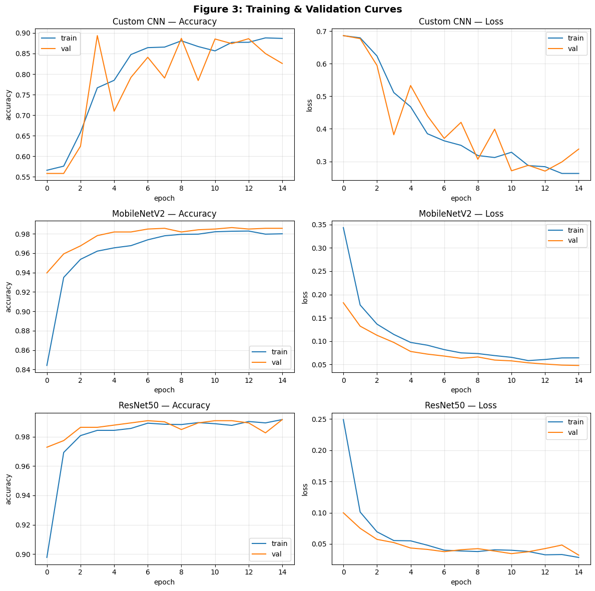
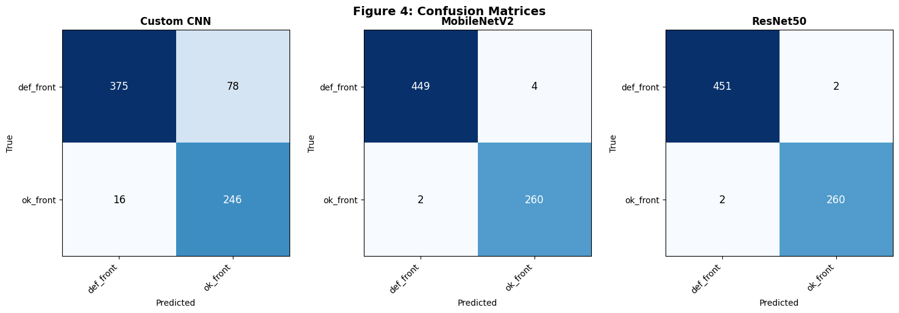
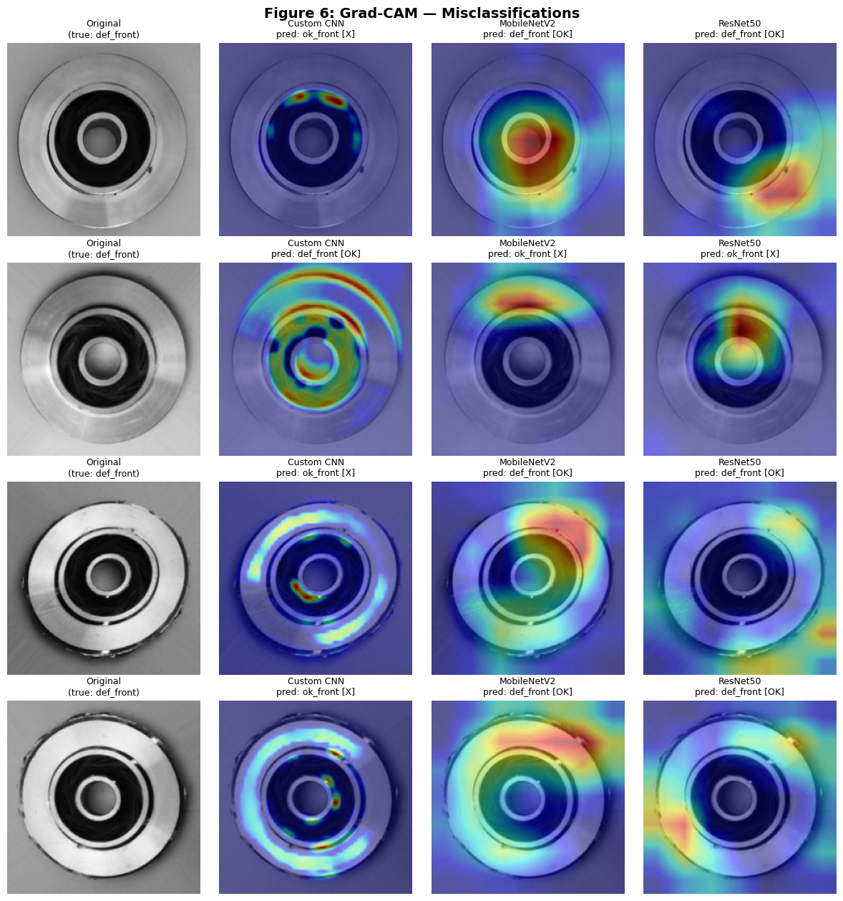

# Casting Defect Classification using CNN and Transfer Learning with Explainable AI

A CNN-based image-classification project that distinguishes **defective** from **acceptable** industrial submersible-pump impeller castings. It trains a custom CNN from scratch and compares it against two transfer-learning models (**MobileNetV2** and **ResNet50**), then uses **Grad-CAM** and **SHAP** to explain what visual evidence each model relies on.

This repository is the Phase 2 submission for the Machine Learning course project.

---

## Problem

Given a top-view photograph of a casting's front face, classify it as:

- `def_front` — defective
- `ok_front` — acceptable

This is a **binary image-classification** task. Manual visual inspection on production lines is slow and subjective, so the goal is an accurate **and interpretable** automated inspection model.

---

## Dataset

**Real-life Industrial Dataset of Casting Product** (submersible-pump impellers), by `ravirajsinh45` on Kaggle.

- **Link:** https://www.kaggle.com/datasets/ravirajsinh45/real-life-industrial-dataset-of-casting-product
- **Classes:** 2 (`def_front`, `ok_front`)
- **Total images:** 7,348 (6,633 train / 715 test)
- **Image type:** grayscale photographs, provided at 300×300 px (a 512×512 variant is also included). Each image is resized to **224×224** and read as **3-channel RGB** for the ImageNet backbones.

| Class | Train | Test | Total |
|---|---:|---:|---:|
| def_front (defective) | 3,758 | 453 | 4,211 |
| ok_front (acceptable) | 2,875 | 262 | 3,137 |
| **Total** | **6,633** | **715** | **7,348** |

During training, 20% of the training images (1,326) are held out for validation; the 715-image test set is used only for final evaluation.

> **Note:** The dataset is **not** stored in this repository. Add it from the Kaggle link above (see *How to run*).

---

## Repository structure

```
casting-defect-classification/
├── README.md                          # this file
├── requirements.txt                   # Python dependencies (for local runs)
├── LICENSE                            # MIT license
├── .gitignore
├── casting_defect_classification.ipynb   # main notebook (source code)
└── outputs/
    ├── figures/                       # generated figures (PNG)
    │   ├── Figure1_dataset_samples.png
    │   ├── Figure2_workflow.png
    │   ├── Figure3_training_curves.png
    │   ├── Figure4_confusion_matrices.png
    │   ├── Figure5_gradcam_correct.png
    │   ├── Figure6_gradcam_misclassified.png
    │   ├── Figure7_SHAP_Custom_CNN.png
    │   ├── Figure7_SHAP_MobileNetV2.png
    │   └── Figure7_SHAP_ResNet50.png
    └── tables/                        # generated tables (CSV)
        ├── dataset_metadata.csv
        ├── model_architecture_summary.csv
        ├── evaluation_results.csv
        ├── confusion_matrix_Custom_CNN.csv
        ├── confusion_matrix_MobileNetV2.csv
        ├── confusion_matrix_ResNet50.csv
        └── final_comparison.csv
```

The notebook itself writes **all** figures as PDF and **all** tables as CSV into `/kaggle/working/outputs`, then zips that folder (`casting_defect_outputs.zip`) for download. The `outputs/` folder here contains a copy of those results for quick viewing on GitHub.

---

## How to run

### Option A — Kaggle (recommended)

1. Open the notebook on Kaggle (or upload `casting_defect_classification.ipynb`).
2. **Add the dataset:** *Add Input* → search *Real-life Industrial Dataset of Casting Product* (by ravirajsinh45) → attach it. The notebook auto-detects the dataset path.
3. **Settings → Accelerator → GPU** (training is much faster).
4. **Settings → Internet → On** (required to download the ImageNet weights for MobileNetV2 and ResNet50). If Internet is off, those models fall back to random weights and are unfrozen.
5. **Run All.**
6. Download the results from the **Output** tab: `casting_defect_outputs.zip`.

### Option B — Local / other environment

```bash
pip install -r requirements.txt
jupyter notebook casting_defect_classification.ipynb
```

Download the dataset from the Kaggle link and update the dataset path at the top of the configuration cell if needed (the notebook scans common locations automatically).

A GPU is strongly recommended. Approximate end-to-end runtime on a Kaggle P100 GPU is a few minutes.

---

## Methodology (summary)

- **Preprocessing:** resize to 224×224; normalization is built into each model (custom CNN → `[0,1]`, MobileNetV2 → `[-1,1]`, ResNet50 → Caffe/BGR), so all models share one raw `[0,255]` pipeline and Grad-CAM/SHAP overlays stay interpretable.
- **Split:** 80/20 train/validation from the training set + a separate held-out test set. Fixed seed (`42`) for reproducibility.
- **Augmentation (training only):** random horizontal flip, small rotation, small zoom.
- **Training:** Adam (lr = 1e-3), sparse categorical cross-entropy, early stopping on validation loss (patience 4), up to 15 epochs.
- **Evaluation:** accuracy, precision/recall/F1 (weighted and macro), confusion matrix, classification report, training time, parameter count.
- **Explainability:** Grad-CAM (correct and misclassified images) and SHAP (selected test images), compared across models.

### Models

| Model | Total params | Trainable | Frozen | Notes |
|---|---:|---:|---:|---|
| Custom CNN | 110,018 | 110,018 | 0 | 3 conv blocks → GAP → dropout → dense |
| MobileNetV2 | 2,260,546 | 2,562 | 2,257,984 | ImageNet base frozen, lightweight head |
| ResNet50 | 23,591,810 | 4,098 | 23,587,712 | ImageNet base frozen, lightweight head |

---

## Results

Evaluated on the 715-image held-out test set:

| Model | Test accuracy | Weighted F1 | Training time | Parameters |
|---|---:|---:|---:|---:|
| Custom CNN | 86.85% | 0.871 | 93 s | 110,018 |
| MobileNetV2 | 99.16% | 0.992 | 126 s | 2,260,546 |
| ResNet50 | **99.44%** | **0.994** | 244 s | 23,591,810 |

**Findings:** transfer learning substantially outperforms the from-scratch CNN. ResNet50 is the most accurate; MobileNetV2 reaches nearly identical accuracy far more efficiently; the custom CNN is the fastest and smallest baseline.

### Training curves


### Confusion matrices


### Grad-CAM on misclassified images


---

## Generated outputs

**Figures (PDF on Kaggle, PNG copies in `outputs/figures/`):**
Figure 1 dataset samples · Figure 2 workflow diagram · Figure 3 accuracy/loss curves · Figure 4 confusion matrices · Figure 5 Grad-CAM (correct) · Figure 6 Grad-CAM (misclassified) · Figure 7 SHAP (one per model).

**Tables (CSV in `outputs/tables/`):**
dataset metadata · model-architecture summary · evaluation results · per-model confusion matrices · final comparison.

---

## License

Released under the MIT License — see `LICENSE`.
